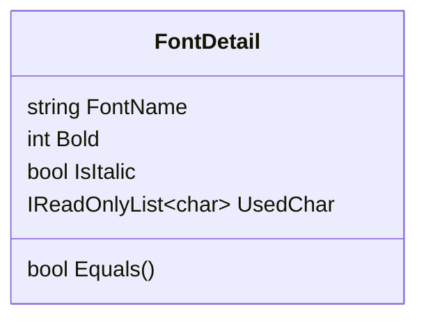

# AssParser

Parse ASS (Advanced SubStation Alpha Subtitles) file faster. No Regex. All managed code.

## Basic Parse

```cs
AssSubtitleModel assfile = await AssSubtitleParser.ParseFileAsync(@"path/to/your/assfile");
```

## List used fonts

```cs
AssSubtitleModel assfile = await AssSubtitleParser.ParseFileAsync(@"path/to/your/assfile");
IReadOnlyList<FontDetail> fonts = assfile.UsedFonts();
```

Where `FontDetail` is defined as



## Get extra section

```cs
AssSubtitleModel assfile = await AssSubtitleParser.ParseAssFile(@"path/to/your/assfile");
string fontsData = assfile.UnknownSections["Fonts"];
```

## Decode & Encode UUEncode

```cs
ReadOnlySpan<byte> data = UUEncode.Decode(fontsData, out var crlf);
ReadOnlySpan<byte> encoded = UUEncode.Eecode(data, crlf)
```

## References

- <https://github.com/AmusementClub/AssParser>
- <http://www.tcax.org/docs/ass-specs.htm>
- <https://github.com/weizhenye/ASS/wiki/ASS-字幕格式规范>
- <https://1e0nhardt.github.io/blog/ass字幕格式.html>
- <https://pyvideotrans.com/blog/ass>
- <https://aegisub.org/docs/latest/script_resolution/>
