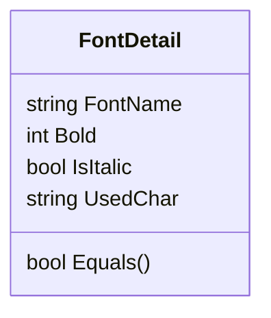

# AssParser &middot; [](https://github.com/Poker-sang/AssParser/actions/workflows/dotnet-nuget.yml)   [](https://github.com/Poker-sang/AssParser/actions/workflows/test.yml)

Parse ASS (Advanced SubStation Alpha Subtitles) file faster. No Regex. All managed code.

## Basic Parse

```cs
AssSubtitleModel assfile = await AssSubtitleParser.ParseFileAsync(@"path/to/your/assfile");
```

## List used fonts

```cs
AssSubtitleModel assfile = await AssSubtitleParser.ParseFileAsync(@"path/to/your/assfile");
IReadOnlyList<FontDetail> fonts = assfile.UsedFonts();
```

Where `FontDetail` is defined as



## Get extra section

```cs
AssSubtitleModel assfile = await AssSubtitleParser.ParseAssFile(@"path/to/your/assfile");
string fontsData = assfile.UnknownSections["Fonts"];
```

## Decode & Encode UUEncode

```cs
ReadOnlySpan<byte> data = UUEncode.Decode(fontsData, out var crlf);
ReadOnlySpan<byte> encoded = UUEncode.Eecode(data, crlf)
```
